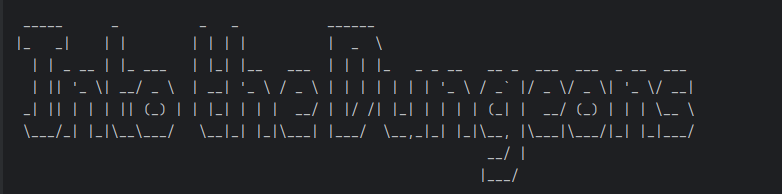
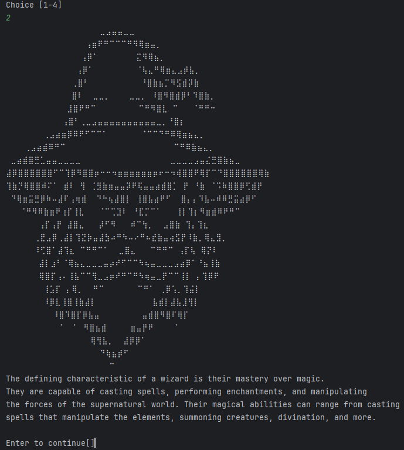
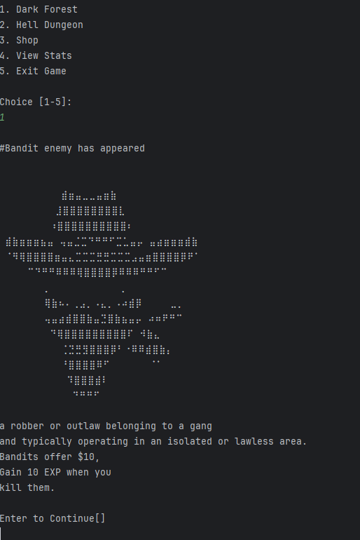

# Text-Based Adventure Game
### A Java Console RPG with Characters, Combat, and Exploration

![Title](# Text-Based Adventure Game
### A Java Console RPG with Characters, Combat, and Exploration


---

## What is this?

A text-based adventure game built in Java where players choose a character class and battle enemies across different environments. Navigate through the story, fight enemies, and survive using your character's unique stats and abilities.

---

## Characters

Choose your hero before the adventure begins:

**1. Knight**
A heavily armored warrior with high defense and powerful melee attacks. Built to take hits and fight on the front lines.

**2. Wizard**



A master of arcane magic with devastating spell damage. Fragile but deadly at range.

**3. Marksman**
A precise ranged fighter who excels at dealing damage from a distance. High accuracy and critical hit potential.

**4. Giant**
A brute force powerhouse with massive health and strength. Slow but nearly unstoppable in combat.

---

## Enemies

Face dangerous foes throughout your journey:

**Bandit**



A forest-dwelling outlaw who ambushes travelers. Quick and cunning, but weak against heavy armor.

---

## Project Structure

```
text-based-adventure-game/
├── assets/
│   ├── character.png         # Character art
│   ├── enemy.png             # Enemy art
│   └── title.png             # Game title screen
├── src/
│   └── AdventureGame_TextBased/
│       ├── Avatar.java           # Base avatar class
│       ├── AvatarList.java       # Available character roster
│       ├── Controller.java       # Game logic controller
│       ├── EnemyStats.java       # Enemy stats and attributes
│       ├── ForestEnemy.java      # Forest enemy type
│       ├── InheritUserStats.java # Character stat inheritance
│       ├── Main.java             # Entry point
│       ├── UserStats.java        # Player stats
│       └── View.java             # Console display/UI
├── TitleGame.txt             # ASCII title screen
└── .gitignore
```

---

## Getting Started

### Prerequisites

- [Java JDK](https://www.oracle.com/java/technologies/downloads/) (v11 or later)
- Any Java IDE (IntelliJ IDEA, Eclipse, VS Code)

---

### Clone the Repository

```bash
git clone https://github.com/AlFrancis-Dagaang/text-based-adventure-game.git
cd text-based-adventure-game
```

---

### Run the Game

**Using an IDE:**

1. Open the project in IntelliJ IDEA or Eclipse
2. Navigate to `src/AdventureGame_TextBased/Main.java`
3. Run `Main.java`

**Using the terminal:**

```bash
javac src/AdventureGame_TextBased/*.java
java -cp src AdventureGame_TextBased.Main
```

---

## Built With

- [Java](https://www.java.com/) — core programming language
- Object-Oriented Programming principles (inheritance, encapsulation, polymorphism)

---

## Author

Made by **AlFrancis Dagaang**

---

## License

This project is open source and available under the [MIT License](LICENSE).)

---

## What is this?

A text-based adventure game built in Java where players choose a character class and battle enemies across different environments. Navigate through the story, fight enemies, and survive using your character's unique stats and abilities.

---

## Characters

Choose your hero before the adventure begins:

**1. Knight**
A heavily armored warrior with high defense and powerful melee attacks. Built to take hits and fight on the front lines.

**2. Wizard**


A master of arcane magic with devastating spell damage. Fragile but deadly at range.

**3. Marksman**
A precise ranged fighter who excels at dealing damage from a distance. High accuracy and critical hit potential.

**4. Giant**
A brute force powerhouse with massive health and strength. Slow but nearly unstoppable in combat.

---

## Enemies

Face dangerous foes throughout your journey:

**Bandit**


A forest-dwelling outlaw who ambushes travelers. Quick and cunning, but weak against heavy armor.

---

## Project Structure

```
text-based-adventure-game/
├── assets/
│   ├── character.png         # Character art
│   ├── enemy.png             # Enemy art
│   └── title.png             # Game title screen
├── src/
│   └── AdventureGame_TextBased/
│       ├── Avatar.java           # Base avatar class
│       ├── AvatarList.java       # Available character roster
│       ├── Controller.java       # Game logic controller
│       ├── EnemyStats.java       # Enemy stats and attributes
│       ├── ForestEnemy.java      # Forest enemy type
│       ├── InheritUserStats.java # Character stat inheritance
│       ├── Main.java             # Entry point
│       ├── UserStats.java        # Player stats
│       └── View.java             # Console display/UI
├── TitleGame.txt             # ASCII title screen
└── .gitignore
```

---

## Getting Started

### Prerequisites

- [Java JDK](https://www.oracle.com/java/technologies/downloads/) (v11 or later)
- Any Java IDE (IntelliJ IDEA, Eclipse, VS Code)

---

### Clone the Repository

```bash
git clone https://github.com/AlFrancis-Dagaang/text-based-adventure-game.git
cd text-based-adventure-game
```

---

### Run the Game

**Using an IDE:**

1. Open the project in IntelliJ IDEA or Eclipse
2. Navigate to `src/AdventureGame_TextBased/Main.java`
3. Run `Main.java`

**Using the terminal:**

```bash
javac src/AdventureGame_TextBased/*.java
java -cp src AdventureGame_TextBased.Main
```

---

## Built With

- [Java](https://www.java.com/) — core programming language
- Object-Oriented Programming principles (inheritance, encapsulation, polymorphism)

---

## Author

Made by **AlFrancis Dagaang**

---

## License

This project is open source and available under the [MIT License](LICENSE).